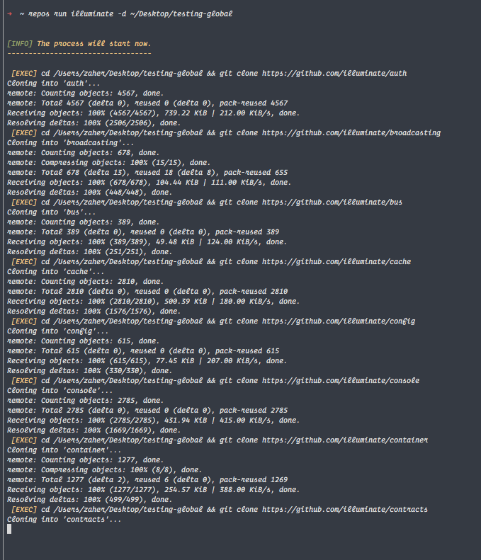

# GitHub Repos Downloader
> a fun project to download a full list of all the public repos for a github user

This project has only one main idea is to download all the public repos for specific github user.

## Requirements
1. PHP 7.2
1. Composer
1. Git

## Installation

1. Clone the repository

```
$ git clone https://github.com/linuxjuggler/github-repos-downloader.git
```

2. Run Composer

```
$ composer install
```

## Global Installation

If you want you can install the package globally using composer

```
$ composer global require damascene/repos-downloader
```

## Using PHAR file

You have to download the phar file from the [release](https://github.com/zaherg/github-repos-downloader/releases) tab

# Usage cases

1. Run the clone command

First you need to decide which user's repositories you want to clone
Second run the command (if you have clone it you should run the command from within the directory):

```
$ repos run <user> -d <directory> -p <pageNumber> -e <excluded_repo1>.<excluded_repo2>
```

Replace the _user_ with the user name and _directory_ with the directoy you want to have all your data,
for example the following command will clone all the public repositories for *illuminate* on my desktop on a directory called *testing-global*
if this directory is not exists, it will be auto created.

```
$ repos run illuminate -d ~/Desktop/testing-global
```

[]

## Why

To be honest I just built this so that I can download all the public repos without going 
over each and every one to clone them one by one.
So this is only built for educational purpose, for example, in the next few months am planning to dive more into Illuminate 
packages, so this will help me to download them all not one by one.

## TODO

Add the ability to _pull_ the new updates instead of reclone them again.
